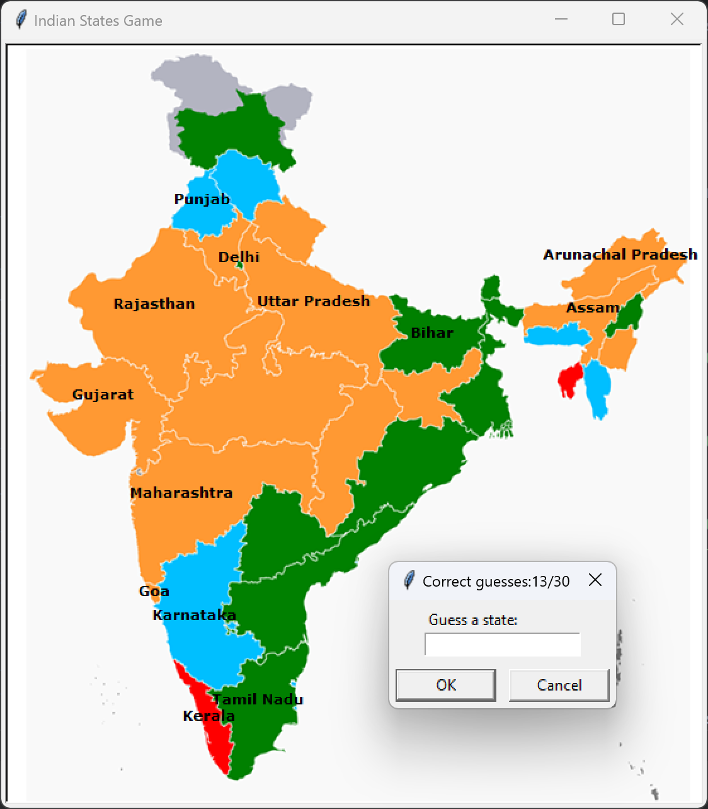
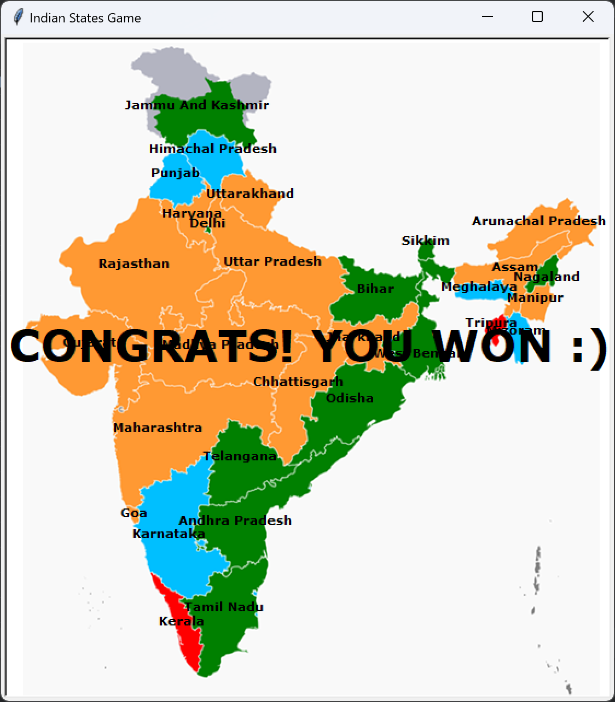

# India States Guessing Game

Welcome to the India States Guessing Game! This simple Python game allows you to test your knowledge of Indian states by guessing their names based on their positions on the map.

## How to Play

1. Run the `india_states_game.py` script.
2. You will be prompted to enter the name of an Indian state.
3. If your guess is correct, the state name will be displayed on the map at its corresponding location.
4. Continue guessing until you have correctly identified all 30 states or type "exit" to end the game.
5. If you complete the game successfully, you'll see a "YOU WON" message in the middle of the screen.

## Data Source

The game uses a CSV file (`states_data.csv`) containing the names of all Indian states and their corresponding x and y coordinates on the map. This data allows the turtle to move to the correct location on the map and display the state name when guessed correctly.

## States To Learn

If you decide to exit the game before completing it, the names of the states you couldn't guess will be stored in a file called `states_to_learn.txt`. You can use this file to practice and improve your knowledge later.

## Getting Started

1. Clone this repository to your local machine.

    ```bash
    git clone https://github.com/your-username/india-states-guessing-game.git
    ```

2. Navigate to the project directory.

    ```bash
    cd india-states-guessing-game
    ```

3. Run the game script.

    ```bash
    python india_states_game.py
    ```

## Screenshots

<h1>What the game looks like -</h1>


<h1>When you win the game by guessing all the states correctly -</h1>

*When you successfully guess all the states*

